# AI-Powered Competitive Intelligence

A multi-source competitive intelligence for credit card products that tracks
competitor news, loyalty program changes, card offers, and cardholder sentiment 
from social platforms.

This pipeline eliminates manual research and automates the full pipeline: multi-source data collection, NLP-based deduplication and clustering, AI-driven summarization, and report generation. This engine can process thousands of articles into a structured brief using a single Claude API call at under $0.25 per run, improving time-to-insight by 95%.

**[View Project →](https://tasmiahr.github.io/ai-competitive-intelligence/)** 

---

## What it does

Each month, three parallel data pipelines activate and feed into a single synthesis step.

### 📰 News Intelligence
Scrapes Google News RSS across three query buckets per competitor including loyalty program changes, card product news, and company-level developments.
  
Raw articles pass through a four-stage NLP pipeline:
-  A guide filter removes evergreen content and listicles,
-  Exact deduplication removes identical headlines,
-  Semantic deduplication uses BERT sentence embeddings with cosine similarity to catch near-identical rewrites, and
- DBSCAN clustering groups articles about the same story across sources.

Each cluster becomes a theme, which Claude Haiku summarizes in one sentence.

### 📱 Social Sentiment
Queries relevant Reddit subreddits using its public JSON endpoints with no API key required. 
- Posts mentioning each competitor are scored for sentiment and aggregated into per-competitor signals, surfacing what cardholders are actually saying rather than what press releases say.
- Queries four subreddits: r/creditcards, r/churning, r/awardtravel, r/personalfinance

### 🖼️ Visual Change Tracking
Takes full-page Playwright screenshots of competitor card offer pages monthly.
- Pillow pixel diff check is used for pages with more than 500 changed pixels and sent to Claude Vision.
- The changed region is cropped to its bounding box before the API call, minimizing token cost.
- Changes are classified by business impact: bonus increases, fee changes, new offers, messaging shifts, CTA changes.

All three outputs feed into a single Claude Haiku call that generates competitor summaries, an executive summary, and five market trends. The pipeline bakes everything into a self-contained HTML dashboard — no server, no runtime dependencies — deployed automatically to GitHub Pages on every run.

---

## Technical highlights

- **DBSCAN over K-Means** for news clustering — avoids specifying cluster count upfront, handles variable story volume naturally, and treats noise (unique articles) as first-class output rather than forcing them into clusters
- **BERT sentence embeddings** (all-MiniLM-L6-v2) for semantic deduplication — catches near-identical rewrites with different headlines that exact matching misses
- **Pillow pixel diff gating** before Claude Vision — free local comparison eliminates API calls for unchanged pages, reducing visual tracking cost by ~60–70% depending on month
- **Bounding box cropping** on detected changes — sends only the changed region to Claude rather than full-page screenshots, further minimizing Vision token usage
- **Single-call brief generation** — all theme summaries (~30 tokens each) fit in one Claude Haiku call returning structured JSON with competitor paragraphs, executive summary, and trends; splitting per-competitor would cost ~12× more with no quality gain
- **Self-contained HTML output** — `generate_html.py` bakes all data as JavaScript into a static file at build time; opens in any browser, no server required, deploys to GitHub Pages without configuration
- **Public Reddit JSON endpoints** — no API key, no rate limit concerns at monthly scraping volume; `requests.get` with `.json` suffix on any Reddit URL returns structured post data

---

## Architecture

---

## Stack

| Layer | Technology |
|-------|-----------|
| News scraping | Python, Google News RSS, BeautifulSoup |
| Semantic dedup | sentence-transformers (all-MiniLM-L6-v2) |
| Clustering | scikit-learn DBSCAN |
| AI summarization | Claude Haiku (themes + brief), Claude Sonnet (visual changes) |
| Web rendering | Playwright (screenshots + JS-rendered card extraction) |
| Visual diff | Pillow (pixel diff + bounding box crop) |
| Social data | Reddit public JSON (no API key) |
| Automation | GitHub Actions |
| Dashboard | Python-generated self-contained HTML + Chart.js |
| Export | python-docx (Word document) |
| Local analytics | DuckDB |

---

## Cost

| Task | Model | Monthly cost |
|------|-------|-------------|
| Theme summaries (~100 themes) | Claude Haiku | ~$0.08 |
| Monthly brief (1 call) | Claude Haiku | ~$0.003 |
| Visual change analysis (changed sites only) | Claude Sonnet | ~$0.05–0.07 |
| Card offer extraction | Claude Haiku | ~$0.016 |
| Reddit + news scraping | No AI | $0 |
| **Total** | | **~$0.15–0.20/month** |

Cost was a major factor during technical design considerations. 90% reduction in Claude API usage compared to a naive per-article summarization approach, achieved by clustering articles into themes first and summarizing at the theme level, then batching all themes into a single brief generation call.

---

*Built by [Ridi Tasmiah](https://www.linkedin.com/in/riditasmiah)*
